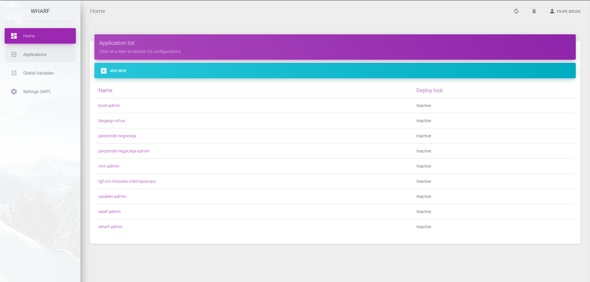
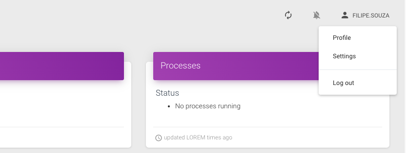
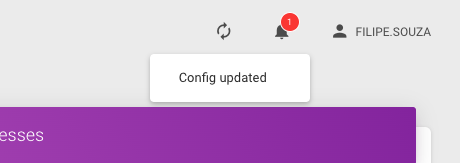
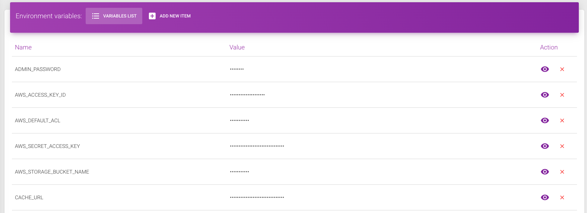

Wharf
=====

1. [About this fork](#about-this-fork)
2. [Pre requisites](#pre-requisites)
3. [Setup](#setup)
4. [Helpful hints](#helpful-hints)
5. [Enabling Github auto-deploy webhooks](#enabling-github-auto-deploy-webhooks)
6. [Development setup](#development-setup)
7. [Roadmap](#roadmap)
8. [Screenshots](#screenshots)

Wharf is an web frontend for [Dokku](http://dokku.viewdocs.io/dokku/). 

Dokku is a great Heroku-like tool, with a extensive command line operation. This web interface aims to 
simplify some routine tasks when managing applications on Dokku.

## Setup

1. [Install Dokku](http://dokku.viewdocs.io/dokku/getting-started/installation) (versions up to 0.19.13, see [#78](https://github.com/palfrey/wharf/issues/78))
2. Install the following plugins:
  * https://github.com/dokku/dokku-redis (versions up to 1.10.4, see [#75](https://github.com/palfrey/wharf/issues/75))
  * https://github.com/dokku/dokku-postgres (versions up to 1.9.5, see [#75](https://github.com/palfrey/wharf/issues/75))
  * https://github.com/dokku/dokku-letsencrypt
  * https://github.com/dokku/dokku-mariadb
3. Get a [A Google API & Services OAuth Credentials to login in.](https://console.developers.google.com/apis/credentials), with API Key and OAuth 2.0 Client IDs setup.
3. Setup the Let's Encrypt plugin to auto-renew: (`dokku letsencrypt:cron-job --add`)
4. Create a new app: (`dokku apps:create wharf`)
5. Add SSH key storage:
  * `mkdir /var/lib/dokku/data/storage/wharf-ssh/`
  * `chown dokku:dokku /var/lib/dokku/data/storage/wharf-ssh/`
  * `dokku storage:mount wharf /var/lib/dokku/data/storage/wharf-ssh/:/root/.ssh`
6. Add a Redis link (`dokku redis:create wharf && dokku redis:link wharf wharf`)
7. Add Postgres link (`dokku postgres:create wharf && dokku postgres:link wharf wharf`)
8. Set `ADMIN_PASSWORD` to something secret (`dokku config:set wharf ADMIN_PASSWORD=somesecret`)
9. Deploy this Git repo [as per the standard Dokku instructions](http://dokku.viewdocs.io/dokku/deployment/application-deployment/)

## Helpful hints

* If you're running SSH on a non-standard port, set `DOKKU_SSH_PORT` e.g. `dokku config:set wharf DOKKU_SSH_PORT=2222`
* If Dokku is running somewhere else than the local machine, set `DOKKU_SSH_HOST` e.g. `dokku config:set wharf DOKKU_SSH_HOST=foo.example.com`
* If there's a Dockerfile in your repository, it'll [try and deploy using that by default](http://dokku.viewdocs.io/dokku/deployment/methods/dockerfiles/).
 Set BUILDPACK_URL to override this behaviour.
* BUILDPACK_URL should be an HTTPS one, not a SSH or heroku/something one
* You should setup the global domain name when creating Dokku to start with and add a *.&lt;your dokku domain&gt; entry to give new apps more usable names.

## Enabling Github auto-deploy webhooks

1. Set `GITHUB_SECRET` config item to something secret
2. Goto [settings/webhooks](https://developer.github.com/webhooks/creating/#setting-up-a-webhook) in Github
3. Make a new webhook for &lt;your Wharf instance&gt;/webhook with Content type as `application/json` and Secret to the secret from `GITHUB_SECRET`

## Development setup

Setup a dokku machine with Vagrant and a Wharf development environment with Docker and Docker Compose.

1. `vagrant up` which will boot the entire Dokku setup in a VM

2. Create a .env file (just copy .env.example to .env) and add the needed variables values from your setup:
    * DATABASE_URL
    * BROKER_URL
    * CACHE_URL
    * DOKKU_SSH_HOST
    * DOKKU_SSH_PORT
    * GITHUB_SECRET
    * ADMIN_PASSWORD
    * SOCIAL_AUTH_GOOGLE_OAUTH2_KEY
    * SOCIAL_AUTH_GOOGLE_OAUTH2_SECRET
    * SECRET_KEY

3. Run `docker-compose up -d` to start project services up.
    * Recommended running `docker-compose up -d --build --force-recreate`. This will generate a new SSH key and invalidate any configuration or data.
    * `host.docker.internal` works on Mac/Windows, but not on Linux (see https://github.com/docker/for-linux/issues/264). 
    * On Linux hosts, you should set `DOKKU_SSH_HOST` to whatever your IP is (not localhost, but a local IP is fine)
    
4. Load up `http://localhost:8000/`

## Roadmap

* A access level control to logged in accounts;

* The application configuration misses some Dokku features:
  * exposing ports on application links;
  * rebuilding application;

* Add a Slack integration to notify about tasks results;

* Fixing many frontend bugs;

* Optimizing cache usage;

* Creating a settings page to hold users configuration;

## Screenshots

